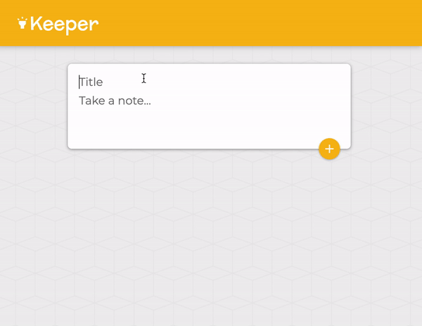

# 💡Clone Google Keep

## Description
Keeper is a Post-it notes web application based on React.js to record user’s temporary ideas.

## App Walk-through

## Related Skills
* JavaScript expressions in JSX and ES6 template Literals
* React components, React props,React DevTools, React Hooks - useState, React Forms
* Mapping fata to components
* Managing a component Tree
* Changing complex state
